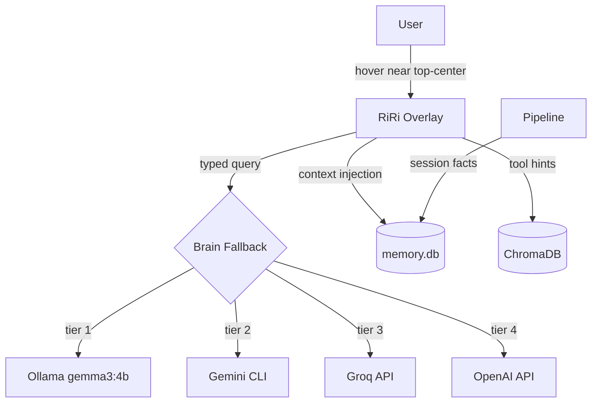
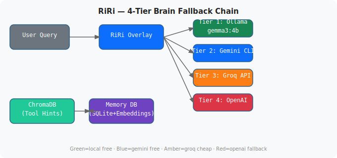

# RiRi — Personal AI Overlay

**Type**: Desktop AI assistant | **Stack**: Python GTK3, Ollama, SQLite, ChromaDB
**Status**: Live on Ahmed's workstation

---

## The Problem

Every AI assistant is either a browser tab you have to switch to or a terminal command that breaks your flow. The goal was an ambient AI layer that stays completely invisible until you need it — no clicks, no context switch, just a hover.

## Solution

RiRi is a transparent pill-shaped overlay window that lives at the top-center of the screen where the system clock sits. At idle it's invisible (opacity 0). Hover within ~150px of the top edge, and it fades in with a spring animation. Type your query, get an answer, move your cursor away — it fades back out.

The entire UI is ~920 lines of Python using GTK3 with an RGBA visual composite for true transparency. No Electron, no web view, no browser. A sub-second startup time and ~50MB RAM footprint.

## Architecture

### Brain Fallback Chain

RiRi uses a 4-tier AI fallback to minimise paid token consumption:

```
Tier 1  →  Ollama (gemma3:4b, local)       [free, always first]
Tier 2  →  Gemini CLI (gemini-2.0-flash)   [free tier, fast]
Tier 3  →  Groq API (llama-3.3-70b)        [very cheap, 0.59/M tokens]
Tier 4  →  OpenAI (gpt-4o-mini)            [fallback only]
```

A colour-coded tier indicator label in the RiRi header shows which tier answered. In practice, ~90% of queries are handled by Tier 1–2 at zero cost.

### Memory System

Persistent memory is stored in SQLite at `~/.local/share/riri/memory.db`. Each memory entry is embedded with `nomic-embed-text` (768-dimensional vectors) via Ollama's embedding API. At query time, RiRi runs cosine similarity against recent memories and injects the top-k results as context into the brain prompt.

At session end (via Claude Code's Stop hook), conversations are compacted by Ollama into structured facts and stored — meaning RiRi learns from every Claude Code session automatically.

Current memory store: **639 memory entries**

### IPC Interface

Other processes communicate with RiRi via a Unix socket at `/tmp/riri.sock`:

| Command | Effect |
|---|---|
| `notify:message` | Show message in chat bubble |
| `expand` | Force window visible |
| `hide` | Force window hidden |
| `ask:question` | Send a question to brain, print reply |

### Diagram



## Key Technical Decisions

**GTK3 RGBA visual** — Required for per-pixel alpha. Other options (Qt, Tk) either lack true compositing or add significant overhead on Wayland/X11. GTK3 with `screen.is_composited()` check gives true transparency with ~0ms render cost.

**Hover detection via GLib polling** — Instead of X11 enter/leave events (which only fire inside the window), a 120ms GLib timer polls the global cursor position. This lets the hover trigger activate from any distance.

**set_opacity on GDK window** — GTK's own `Window.set_opacity()` is deprecated; the correct call is `self.get_window().set_opacity(val)` which applies at the compositor level without a redraw.

## Outcome

- Zero context switching to ask a question mid-task
- Full memory of every Claude Code session
- Free for ~95% of daily queries (local Ollama)
- Aware of all available CLI tools via ChromaDB semantic search

## Architecture Diagram


