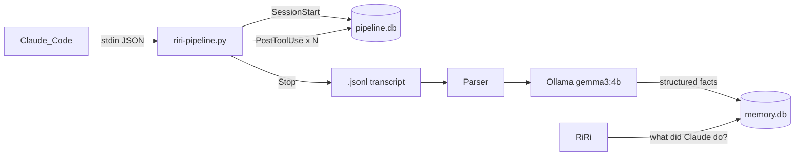
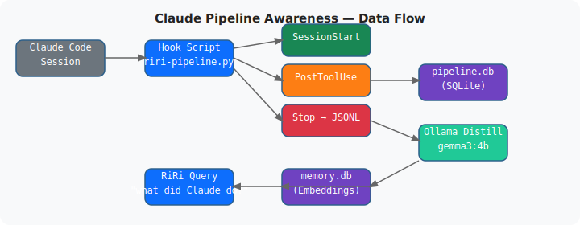

# Claude Pipeline Awareness

**Type**: Claude Code hook integration | **Stack**: Python, SQLite, Ollama, JSONL
**Status**: Live — wired into all Claude Code sessions

---

## The Problem

Claude Code sessions can run for hours, editing dozens of files, running hundreds of commands. But once a session ends, all that context vanishes. There's no way to ask "what did Claude do yesterday in the outreach engine?" or "what bugs did it fix last week?"

## Solution

A hook script (`~/.claude/hooks/riri-pipeline.py`) intercepts every Claude Code lifecycle event and feeds structured data into RiRi's memory. The result is a fully queryable audit trail of every AI-assisted work session.

## How It Works

Claude Code supports lifecycle hooks via `~/.claude/settings.json`. Three hooks are active:

### SessionStart
When Claude Code opens a session, the hook receives:
```json
{"session_id": "abc123", "cwd": "/home/ahmed/projects/outreach-engine"}
```
The session is logged to `pipeline.db` with the derived project name and a timestamp.

### PostToolUse
After every tool call (Bash, Write, Edit, WebFetch, WebSearch, Task), the hook receives the tool name, input, and output. Signal tools are extracted:

| Signal | What's captured |
|---|---|
| `Bash` | Command + exit code (failures flagged) |
| `Write` / `Edit` | File path → tracked in `files_changed` |
| `WebFetch` | URL fetched |
| `WebSearch` | Search query |
| `Task` | Sub-agent description |

Trivial reads (`cat`, `ls`, `echo`) are filtered out to keep the signal clean. The session's `turn_count` is incremented per tool call.

### Stop (End of Session)
This is where the heavy lifting happens:
1. Locate the session's `.jsonl` transcript file at `~/.claude/projects/<slug>/<session-id>.jsonl`
2. Parse it into a readable narrative (user prompts, assistant replies, tool calls — last 60 events)
3. Send narrative + session metadata to Ollama (`gemma3:4b`) with a structured extraction prompt
4. Receive JSON: `{summary, key_changes, problems_solved, still_todo, important_facts}`
5. Store each field as individual memories in RiRi's memory DB with appropriate tags
6. Update `pipeline.db` with the summary
7. Notify RiRi overlay: "Claude finished 'outreach-engine' — 3 files changed"

### Diagram



## Current Stats

- **Sessions tracked**: 3
- **Tool events buffered**: 6
- **Hook script size**: 545 lines

## Querying from RiRi

When you ask RiRi anything containing "claude", "session", "what did", "yesterday", or "last time", it automatically calls `_pipeline_context()` which pulls the 4 most recent sessions from the pipeline DB and injects them as context into the brain prompt. No special syntax required.

You can also type `pipeline:` or `sessions` in the RiRi input to get a formatted session list directly.

## Design Constraints

**90s Stop hook timeout** — Ollama distillation of a long session transcript takes 30–60 seconds. The Stop hook is configured with a 120-second timeout to allow this.

**PostToolUse at 3 seconds** — This hook must be fast and non-blocking. It only does SQLite writes; no LLM calls.

**Walrus operator bug** — An early bug used `sys.stdin.read(strip := True)` (invalid walrus usage) causing all sessions to get ID "unknown". Fixed to `sys.stdin.read().strip()`.

## Outcome

Full visibility into every Claude Code session. Query RiRi with natural language to get answers like "what bugs did Claude fix in riri this week?" or "which files changed in the outreach engine recently?"

## Architecture Diagram


