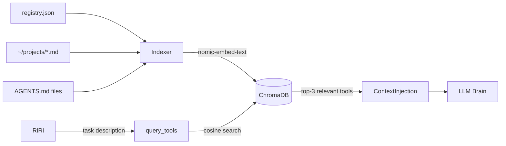
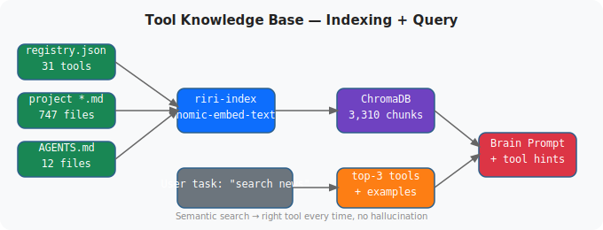

# Tool Knowledge Base — ChromaDB + Registry

**Type**: Semantic tool discovery | **Stack**: ChromaDB, Ollama embeddings, JSON registry
**Status**: Live — 3322 chunks indexed

---

## The Problem

A brain (LLM) given a task like "download the latest AI news" might hallucinate a tool name, use the wrong flag format, or not know that `ddgs news -k '...' -m 5` exists. The tools are on the system — the brain just doesn't know about them.

## Solution

A two-layer system: a structured JSON tool registry defining every available CLI tool with examples, paired with a ChromaDB vector database that makes the registry semantically searchable. At query time, RiRi looks up relevant tools and injects them into the brain's context window.

## Tool Registry

The registry lives at `~/projects/riri/tools/registry.json` and currently covers **31 tools** across **11 categories**:

| Category | Tools |
|---|---|
| web_search | ddgs, trafilatura, yt-dlp |
| browser_automation | browser-use, google-chrome |
| google_workspace | gws (Gmail, Drive, Calendar, Tasks, Keep) |
| ai_models | ollama, gemini, gsd, litellm, openai |
| devops_git | gh, git, docker, vercel, neonctl |
| outreach_engine | outreach |
| document_processing | docling, pdfplumber, magika, mammoth |
| media | ffmpeg, ImageMagick convert |
| data | jq, chroma |
| system_services | systemctl, riri notify |
| ml_training | huggingface-cli, transformers-cli, unsloth, accelerate |

Each entry includes the binary name, a description, and 2–5 usage examples with real flags.

## Indexing Pipeline

The indexer (`~/projects/riri/tools/index.py`) runs three passes:

1. **Tool registry** — Each tool becomes a rich text chunk: name, category, description, examples. All 31 tools indexed as individual documents.

2. **Project docs** — Recursively indexes all `.md` files under `~/projects/` and `~/claude-powers/`. Chunked at 800 characters with 150-character overlap to preserve context across chunk boundaries.

3. **AGENTS.md files** — Indexes all Paperclip agent instruction files, so the brain can look up how to operate specific tools or follow specific workflows.

Embeddings are generated via Ollama's `nomic-embed-text` model (768 dimensions) through ChromaDB's `OllamaEmbeddingFunction` wrapper. The collection is persisted at `~/.local/share/riri/chroma/`.

**Current stats**: 3322 total chunks

### Diagram

## How RiRi Uses It

When you ask RiRi something like "download this YouTube video", the `_tool_hints()` function:
1. Sends the task description to ChromaDB as an embedding query
2. Gets back the top-3 semantically relevant tool docs (e.g. `yt-dlp` at score 0.636)
3. Injects those docs above the brain prompt as a `[Relevant tools from knowledge base]` block

The brain then has the exact command syntax and flags it needs — no hallucination.

**Tested similarity scores** (lower distance = better match):
- "download youtube video" → yt-dlp: 0.636
- "search for news" → ddgs: 0.623
- "send an email" → gws gmail: ~0.71

## Re-indexing

Run `riri-index` to do a full reindex. Add a single file with `riri-index --add path/to/doc.md`. The binary is symlinked at `~/.local/bin/riri-index`.

## Outcome

The brain reliably picks the right tool for any task without hallucinating. Extending the system with a new tool takes ~5 lines in `registry.json` plus a `riri-index --tools` run.

## Architecture Diagram

