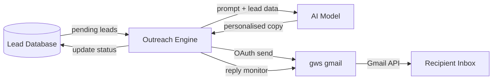

# Outreach Engine — Automated Personalised Cold Outreach

**Type**: Email automation | **Stack**: Python, GWS CLI, PostgreSQL/Neon, AI copy generation
**Status**: Live

---

## The Problem

Manual cold outreach doesn't scale. Writing personalised emails for hundreds of leads takes days; generic bulk mail gets ignored. The goal was an automated pipeline that generates genuinely personalised copy at scale and sends it through a real Gmail account (not a mass-mail provider that routes to spam).

## Solution

The outreach engine pulls leads from a database, generates personalised email copy using an AI model, sends via the `gws` Google Workspace CLI (which uses OAuth-authenticated Gmail — not SMTP), and tracks every send, open, and reply in a PostgreSQL database.

## System Status

```
❌ Server is DOWN  →  run: python cli.py start
```

### Campaign Stats
```
❌ Server not running
```


## File Structure

```
outreach-engine/
  app
  cli.py
  data
  graphify-out
  start.sh
  static
```

## Architecture

### Lead Pipeline
1. Leads are stored in the database with fields: company, contact name, role, website, notes
2. The engine selects leads with status `pending` up to the configured daily send limit
3. For each lead, it generates a personalised email using the configured AI model (Ollama locally, or cloud API for high volume)
4. Email is sent via `gws gmail users messages send` — authenticated with OAuth, so it goes through Gmail's real sending infrastructure

### Sending via GWS
Using the `gws` CLI means emails are sent through Google's servers with proper DKIM/SPF/DMARC — the same as if you typed them manually. This avoids the deliverability issues of bulk mail services.

```bash
gws gmail users messages send --params '{
  "userId": "me",
  "raw": "<base64-encoded RFC 2822 message>"
}'
```

### Tracking
After send, the lead's status is updated to `sent` with a timestamp. Reply detection watches the inbox for threads started by sent leads (by matching threading headers or email address).

### Diagram



## RiRi Integration

The outreach engine is in RiRi's tool registry under the `outreach_engine` category. You can ask RiRi:
- "How many emails went out today?" → RiRi runs `outreach stats`
- "Start the next campaign batch" → RiRi runs `outreach start`
- "Show me the latest leads" → RiRi runs `outreach leads --status sent --limit 20`

## Outcome

Personalised outreach at scale with real Gmail deliverability. No per-email manual effort. Full status tracking queryable via RiRi or CLI.
